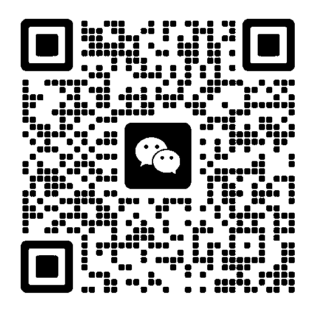

# 星海少年计划页面素材清单

> 基于 `xinghai_ai_founder_v20.html`。当前页面已把 Hero、课程页、结果页的小视觉改为内联 SVG 矢量图形；工作台区改为统一的 AI Workspace Kit 工具盒；页面外部图片依赖为品牌 logo、导师照片与真实咨询二维码。

## 总原则

- 风格：现代、克制、高级、科技感、商业感、AI 创作者、少年创业、未来工作方式。
- 避免：低幼卡通、幼儿园风、廉价炫光、复杂 logo 墙、喧宾夺主的大图。
- 图片作用：增强品牌完成度，不替代页面文案和结构。
- 品牌工具位：不使用 Image 2.0 仿制官方 logo；当前用品牌名/工具名组成统一工具盒，保留真实 AI 创作环境的感觉。

## 当前素材总表

| 模块名称 | 页面位置 | 素材类型 | 是否必需 | 当前状态 | 建议尺寸/比例 | 建议风格 | 用途说明 | Image 2.0 |
|---|---|---:|---:|---|---|---|---|---:|
| Hero / AI 网站卡片 | 首页项目方向 `data-asset-slot="hero-ai-website"` | 内联 SVG 矢量 icon | 必需 | 已完成，替代旧 PNG | 随容器自适应 | UI 窗口 + 箭头，黑白橙 | 表达孩子未来可以做 AI 网站，不是已有案例 | 否 |
| Hero / AI 视频卡片 | 首页项目方向 `data-asset-slot="hero-ai-video"` | 内联 SVG 矢量 icon | 必需 | 已完成，替代旧 PNG | 随容器自适应 | 播放器 + 胶片时间线，黑白橙 | 表达孩子未来可以做 AI 视频 | 否 |
| Hero / AI 音乐卡片 | 首页项目方向 `data-asset-slot="hero-ai-music"` | 内联 SVG 矢量 icon | 必需 | 已完成，替代旧 PNG | 随容器自适应 | 声波 + 音轨，克制科技感 | 表达孩子未来可以做 AI 音乐 | 否 |
| Hero / AI 小说卡片 | 首页项目方向 `data-asset-slot="hero-ai-novel"` | 内联 SVG 矢量 icon | 必需 | 已完成，替代旧 PNG | 随容器自适应 | 文档 + 灵感标记，黑白橙 | 表达孩子未来可以做 AI 小说 | 否 |
| Hero / 主视觉增强 | 首页 passport 右侧 demo window | 背景级抽象产品展示图 | 可选 | 当前不建议新增 | 16:9 或 2:1 | 高端 AI 创作台、轻微空间感 | 若后续觉得首页不够强，可只增强 demo-window 背景 | 待确认 |
| Navigation / 品牌 logo | 顶部导航左侧 `.brand-mark` | Image 2.0 生成品牌标志 | 必需 | 已回填：`assets/brand-mark-xinghai-v21.jpg` | 1:1，128x128 | 黑色圆角、橙色星点、星轨、现代科技感 | 表达星海少年 AI 计划品牌识别 | 已完成 |
| Workspace / AI Workspace Kit | 工作台区 `workspace-kit` | 统一工具盒 / 品牌名 badge 组合 | 必需 | 已完成 | CSS 自适应 | 深色盒子、暖白卡面、橙色重点 | 表达一套真实、高质量的 AI 创作环境 | 否 |
| Workspace / Mac | 工具盒 `data-asset-slot="workspace-mac"` | 品牌名 badge | 必需 | 已完成：`Mac` | 无需图片 | 简洁词标感 | 不再写“创作设备”，直接表达 Mac | 否 |
| Workspace / macOS | 工具盒 `data-asset-slot="workspace-macos"` | 品牌名 badge | 必需 | 已完成：`macOS` | 无需图片 | 系统环境标识 | 表达系统环境，不使用 Apple logo | 否 |
| Workspace / OpenAI | 工具盒 `data-asset-slot="workspace-openai"` | 品牌名 badge | 必需 | 已完成：`OpenAI` | 无需图片 | 词标式工具标识 | 表达核心 AI 能力来源 | 否 |
| Workspace / GPT 5.5 | 工具盒 `data-asset-slot="workspace-gpt"` | 工具名 badge | 必需 | 已完成：`GPT 5.5` | 无需图片 | 橙色重点 badge | 表达生成与研究能力 | 否 |
| Workspace / Codex | 工具盒 `data-asset-slot="workspace-codex"` | 工具名 badge | 必需 | 已完成：`Codex` | 无需图片 | 代码感字体 | 表达 AI 编程能力 | 否 |
| Workspace / Claude | 工具盒 `data-asset-slot="workspace-claude"` | 品牌名 badge | 必需 | 已完成：`Claude` | 无需图片 | 统一 badge | 表达代码协作/推理辅助 | 否 |
| Workspace / Hermes | 工具盒 `data-asset-slot="workspace-hermes"` | 自有工具 badge | 必需 | 已完成：`Hermes` | 无需图片 | 深色重点 badge | 表达项目记忆库/项目地图能力 | 否 |
| Workspace / Token+ | 工具盒 `data-asset-slot="workspace-token"` | 资源能力 badge | 必需 | 已完成：`Token+` | 无需图片 | 简洁资源标识 | 表达充足创作资源 | 否 |
| 三天课程页 | 头脑风暴 / 黑客马拉松 / 模拟投资路演三张卡 | 内联 SVG 矢量 icon | 可选 | 已完成，替代旧 PNG | 随容器自适应 | 黑白橙、统一线性风格 | 加强三天课程扫读识别，不作为主视觉 | 否 |
| PCL 方法论页 | 三张 Level 卡 | 不建议加图 | 否 | 保持当前文字层级 | 无 | 保持卡片节奏 | 该模块靠方法论文本成立，不为了加图而加图 | 否 |
| 孩子带走什么页 | 五张 takeaway 卡 | 内联 SVG 矢量 icon | 可选 | 已完成，替代旧 PNG | 随容器自适应 | 黑白橙、统一线性风格 | 提升五个结果识别度，保持成果清单感 | 否 |
| 导师页 | Mentor 区真人照片与履历 | 真人照片 | 必需 | 已回填：`assets/mentor-wanghao-v21.jpg` | 约 1:1，900x900 | 正式、工整 | 保持当前版式，不加花哨标签；已压缩优化手机加载 | 否 |
| CTA / 咨询二维码 | 最终 CTA hover 弹层 `data-asset-slot="cta-consultation-qr"` | 真实二维码图片 | 必需 | 已回填：`assets/qr-consultation-v21.png` | 近 1:1，520x525 | 清晰黑白码，留白充足 | 鼠标 hover “预约咨询”按钮后展示 | 否 |

## 分区判断

### 1. Hero 区

四个项目方向现在采用统一内联 SVG 矢量 icon。这样比之前的图片缩略图更轻、更干净，也更适合首页小卡片尺寸；语义仍然是“孩子未来可以做出的创作方向”，不是学生案例展示。

Hero 主视觉当前已经有 passport + demo-window，结构成立。暂不建议再新增独立大图，避免首页变重。

### 2. Creator Workspace 区

工作台已从分散功能卡改成一个 `AI Workspace Kit` 工具盒。现在直接展示 `Mac / macOS / OpenAI / GPT 5.5 / Codex / Claude / Hermes / Token+`，去掉“Mac 创作设备”这类解释性弱文案。

这一块的目标是表达“真实、完整、高级的 AI 创作环境”，不是 logo 墙。当前处理为统一 badge 组合，不使用 Image 2.0 仿制官方 logo，也不把 Apple logo 或第三方非官方 logo 硬贴进页面。

### 3. 辅助视觉增强

- 三天课程页：已改为内联 SVG 矢量 icon，保留课程卡片节奏。
- PCL 方法论页：不建议加图。
- 孩子带走什么页：已改为内联 SVG 矢量 icon，保持轻量和一致。

### 4. 导师页

不建议新增图片或花哨标签。当前已有真人照片、底部 badge、右侧正式履历列表，保持即可。

### 5. CTA / 二维码

当前 hover 逻辑保持不变：

- 外层 `.qr-wrap` 包住按钮和弹层。
- 鼠标 hover `.qr-wrap` 时，`.qr-pop` 从透明变为可见。
- `.qr` 内放入真实二维码图片，CSS 假码仅作为无图时的底层占位。

当前真实二维码写法：

```html
<span class="qr" data-asset-slot="cta-consultation-qr">
  
</span>
```

后续如更换二维码，只需要替换 `assets/qr-consultation-v21.png` 或修改该 `src`，不需要改 hover CSS。

## 当前外部素材依赖

页面当前只依赖以下外部素材：

- `assets/brand-mark-xinghai-v21.jpg`
- `assets/mentor-wanghao-v21.jpg`
- `assets/qr-consultation-v21.png`

以下 PNG 是历史素材，v18 页面不再引用，可保留归档，也可以后续清理：

- `assets/hero-ai-website.png`
- `assets/hero-ai-video.png`
- `assets/hero-ai-music.png`
- `assets/hero-ai-novel.png`
- `assets/curriculum-brainstorm.png`
- `assets/curriculum-hackathon.png`
- `assets/curriculum-pitch.png`
- `assets/outcome-website.png`
- `assets/outcome-business.png`
- `assets/outcome-ip.png`
- `assets/outcome-pitch.png`
- `assets/outcome-confidence.png`

## 后续待办

- 若要进一步提升工作台质感，可以基于官方品牌资源页获取可用官方素材；不要用 Image 2.0 临摹或伪造官方 logo。
- 若后续提供新的二维码，只替换 `assets/qr-consultation-v21.png` 即可。
